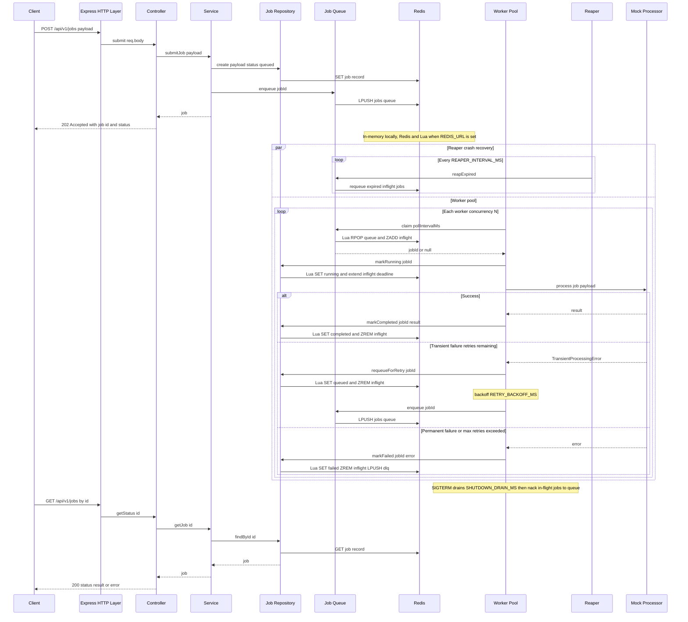
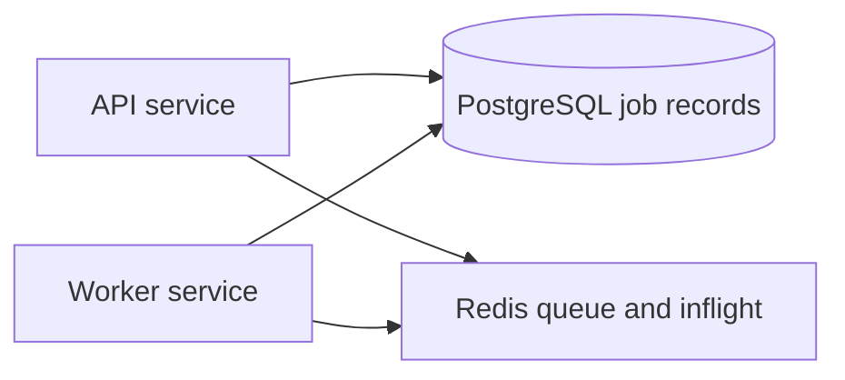

# REST API — Async Job Queue

A production-ready REST API built with **Node.js** and **TypeScript**. Clients submit jobs over HTTP; a background worker pool processes them asynchronously while a status endpoint tracks progress.

Designed for deployment to **GitHub** (with CI) and **DigitalOcean App Platform**.

## Features

- **Job submission** — `POST /api/v1/jobs` accepts a payload and returns a job ID immediately (`202 Accepted`)
- **Background worker pool** — configurable concurrency; mock processor simulates work with `sleep`
- **Status API** — `GET /api/v1/jobs/:id` returns `queued`, `running`, `completed`, or `failed` plus result/error
- **Web dashboard** — simple UI at `/` to submit jobs, poll status, and inspect results
- **Health check** — `GET /health` for load balancers and App Platform probes
- **Concurrency control** — mutex-protected in-memory state; Lua-atomic Redis transitions in production
- **Automated retries** — transient failures are retried with configurable backoff; permanent failures fail immediately
- **Production-safe Redis queue** — claim semantics, visibility timeouts, crash-recovery reaper, graceful shutdown, and dead-letter queue
- **Split deployment** — API and worker run as separate DigitalOcean components sharing Redis

## Architecture

### Flow diagram



### Redis keys (production)

| Key | Type | Purpose |
|-----|------|---------|
| `jobs:queue` | LIST | Job IDs waiting to be claimed (FIFO) |
| `jobs:inflight` | ZSET | Claimed job IDs with visibility deadline scores |
| `jobs:dlq` | LIST | Permanently failed job IDs for ops inspection |
| `job:{id}` | STRING | Full job JSON record (status, payload, result, error) |

### Layer responsibilities

| Layer | Responsibility |
|-------|----------------|
| `routes/` | HTTP routing and request validation |
| `controllers/` | Request/response mapping |
| `services/` | Business logic (submit, lookup) |
| `storage/` | Factory — in-memory (local) or Redis (split deploy) |
| `repositories/` | Job persistence (mutex in-memory; Lua-atomic transitions in Redis) |
| `queue/` | Job handoff (mutex in-memory; claim/inflight/reaper in Redis) |
| `redis/` | Lua scripts and Redis key constants |
| `workers/` | Worker pool, reaper loop, graceful shutdown, and job processor |
| `concurrency/` | `AsyncMutex` for safe in-memory shared-state access |

### Concurrency control

HTTP handlers and background workers share the same job store and queue. Locally (no `REDIS_URL`), both live in process memory; in split deploy, API and worker processes share Redis via `createJobStorage()`.

- **In-memory (local dev)** — repository and queue operations run inside `AsyncMutex.runExclusive()` blocks so concurrent HTTP polls and worker updates cannot interleave.
- **Redis (production)** — repository and queue use Lua-scripted atomic transitions, an in-flight ZSET with visibility timeouts, a reaper for crash recovery, and a dead-letter queue for permanent failures.
- **Claim semantics** — `claim()` atomically moves a job from `jobs:queue` to `jobs:inflight` with a visibility deadline instead of destructively popping via `BRPOP`.
- **Crash recovery** — a background reaper requeues in-flight jobs whose visibility deadline has passed (e.g. worker crash or OOM kill).
- **Graceful shutdown** — on `SIGTERM`, workers drain for `SHUTDOWN_DRAIN_MS`, then `nack()` returns any remaining in-flight jobs to `jobs:queue` for the next worker instance.
- **Status guards** — transitions enforce a strict lifecycle (`queued` → `running` → `completed`/`failed`); concurrent `markRunning` calls on the same job only succeed once.

## API

### Submit a job

```http
POST /api/v1/jobs
Content-Type: application/json

{
  "sleepMs": 2000,
  "data": { "task": "process-report" }
}
```

**Response `202 Accepted`**

```json
{
  "data": {
    "id": "550e8400-e29b-41d4-a716-446655440000",
    "status": "queued"
  }
}
```

| Field | Type | Description |
|-------|------|-------------|
| `sleepMs` | number (optional) | Simulated work duration in ms (default: `1000`) |
| `shouldFail` | boolean (optional) | Permanent failure (not retried) |
| `transientFailureCount` | number (optional) | Simulate N transient failures before success (for testing retries) |
| `data` | object (optional) | Arbitrary payload echoed in the result |

### Retry behavior

When the processor throws a `TransientProcessingError`:

1. Worker increments `retryCount` and resets status to `queued`
2. Waits `RETRY_BACKOFF_MS`, then re-enqueues the job
3. Repeats until success or `retryCount > maxRetries` (then marks `failed`)

Permanent errors (`shouldFail: true`) skip retries and fail immediately.

```bash
# Simulate 2 transient failures before succeeding (requires MAX_JOB_RETRIES >= 2)
curl -X POST http://localhost:8080/api/v1/jobs \
  -H "Content-Type: application/json" \
  -d '{"sleepMs": 500, "transientFailureCount": 2}'
```

### Get job status

```http
GET /api/v1/jobs/:id
```

**Response `200 OK`**

```json
{
  "data": {
    "id": "550e8400-e29b-41d4-a716-446655440000",
    "status": "completed",
    "payload": { "sleepMs": 2000, "data": { "task": "process-report" } },
    "result": {
      "processedAt": "2026-06-15T12:00:02.000Z",
      "sleepMs": 2000,
      "message": "Job completed successfully",
      "input": { "sleepMs": 2000, "data": { "task": "process-report" } }
    },
    "error": null,
    "createdAt": "2026-06-15T12:00:00.000Z",
    "updatedAt": "2026-06-15T12:00:02.000Z",
    "startedAt": "2026-06-15T12:00:00.100Z",
    "completedAt": "2026-06-15T12:00:02.000Z"
  }
}
```

### Health check

```http
GET /health
```

## Web dashboard

With the API running, open `http://localhost:8080/` in a browser.

The dashboard lets you:

- Submit jobs with `sleepMs`, optional JSON payload, and failure simulation flags
- Poll job status automatically until `completed` or `failed`
- Look up any job by ID
- Review jobs submitted during the current browser session

Static assets live in `public/` and are served by the same Express process as the API (no separate frontend build step).

## Setup

**Requirements:** Node.js 20+

```bash
git clone <your-repo-url>
cd <repo-directory>   # folder created by git clone (package name is rest-api, not the directory)
npm install
npm run dev           # http://localhost:8080 — see Execution below for other modes
```

## Execution

### Development

```bash
npm run dev
```

Server runs at `http://localhost:8080` with hot reload.

### Production (single process — local)

```bash
npm run build
npm start          # API + embedded workers (in-memory storage)
```

### Production (split API + worker — requires Redis)

```bash
export REDIS_URL=redis://localhost:6379

npm run build
npm run start:api     # HTTP only, WORKERS_ENABLED=false
npm run start:worker  # background workers only
```

### Example workflow

```bash
# Submit a job
curl -X POST http://localhost:8080/api/v1/jobs \
  -H "Content-Type: application/json" \
  -d '{"sleepMs": 2000, "data": {"task": "demo"}}'

# Poll for status (replace JOB_ID)
curl http://localhost:8080/api/v1/jobs/JOB_ID
```

## Scripts

| Command | Description |
|---------|-------------|
| `npm run dev` | Start dev server with hot reload |
| `npm run build` | Compile TypeScript to `dist/` |
| `npm start` | Run API with embedded workers (local/single-instance) |
| `npm run start:api` | Run HTTP API only (no workers) |
| `npm run start:worker` | Run worker process only (requires `REDIS_URL`) |
| `npm test` | Run all tests (unit + integration) |
| `npm run test:unit` | Run worker/repository unit tests |
| `npm run test:integration` | Run HTTP API integration tests |
| `npm run lint` | Lint source and tests |
| `npm run typecheck` | Type-check without emitting |

## Testing

Tests are split by scope:

| Suite | Location | Covers |
|-------|----------|--------|
| Unit | `tests/unit/` | Worker pool lifecycle, processor mock logic, repository concurrency |
| Unit (Redis) | `tests/unit/redis-*.test.ts`, `storage.test.ts` | Redis repository, queue, storage factory, failure injection |
| Integration | `tests/integration/` | Full HTTP request/response flow via supertest |
| Integration (Redis) | `tests/integration/redis-jobs.test.ts` | Split API + worker sharing FakeRedis (simulates DO production) |

```bash
npm test                 # all tests
npm run test:unit        # unit only
npm run test:integration # integration only
npm run test:redis       # Redis-specific tests only
```

Redis tests use `FakeRedis` (in-memory stand-in) so CI does not require a live Redis server. Optional: run against real Redis locally with `REDIS_URL=redis://localhost:6379`.

## CI/CD

GitHub Actions (`.github/workflows/ci.yml`) runs on every push and pull request to `main`:

1. `npm ci`
2. `npm run typecheck`
3. `npm run lint`
4. `npm test`
5. `npm run build`

## Environment variables

| Variable | Default | Description |
|----------|---------|-------------|
| `PORT` | `8080` | HTTP listen port (DigitalOcean sets this automatically) |
| `NODE_ENV` | `development` | Runtime environment |
| `API_PREFIX` | `/api/v1` | API route prefix |
| `WORKER_CONCURRENCY` | `2` | Number of concurrent background workers |
| `WORKER_POLL_INTERVAL_MS` | `250` | Queue poll interval when idle |
| `DEFAULT_JOB_SLEEP_MS` | `1000` | Default simulated work duration |
| `MAX_JOB_RETRIES` | `3` | Max automatic retries for transient failures |
| `RETRY_BACKOFF_MS` | `1000` | Delay before re-enqueueing a failed job |
| `VISIBILITY_TIMEOUT_MS` | `120000` | How long a claimed job may run before the reaper requeues it (must exceed max job duration) |
| `REAPER_INTERVAL_MS` | `5000` | How often workers scan for expired in-flight jobs |
| `SHUTDOWN_DRAIN_MS` | `10000` | Graceful shutdown window before nacking in-flight jobs back to the queue |
| `WORKERS_ENABLED` | `true` | Set `false` on API service when workers run separately |
| `REDIS_URL` | — | Redis URL (required for split API/worker deployment) |

## Deploy to DigitalOcean App Platform

The included [`.do/app.yaml`](.do/app.yaml) defines three components:

| Component | Type | Run command | Purpose |
|-----------|------|-------------|---------|
| `api` | Web service | `npm run start:api` | Accepts job submissions, serves status API |
| `worker` | Worker | `npm run start:worker` | Processes jobs from the shared queue |
| `job-queue-redis` | Redis 7 | — | Shared job store and queue |

### Option 1: DigitalOcean control panel

1. Push this repo to GitHub (`AlexanderWong/workspaces`).
2. Go to [DigitalOcean Apps](https://cloud.digitalocean.com/apps) → **Create App** → **GitHub**.
3. Select the repo and branch `main`.
4. App Platform reads `.do/app.yaml` automatically, or set manually:
   - **API service:** build `npm run build`, run `npm run start:api`, port `8080`, health check `/health`
   - **Worker service:** build `npm run build`, run `npm run start:worker`
   - **Database:** add a Redis 7 cluster; bind `REDIS_URL` to both components
5. Set env vars on both services: `MAX_JOB_RETRIES=3`, `RETRY_BACKOFF_MS=1000`
6. Deploy.

### Option 2: doctl CLI

```bash
# Authenticate (one-time)
doctl auth init

# Create the app from the spec
doctl apps create --spec .do/app.yaml

# Watch deployment progress
doctl apps list
doctl apps get <APP_ID> --format DefaultIngress --no-header
```

### Verify deployment

```bash
# Replace with your App Platform URL
APP_URL=https://your-app.ondigitalocean.app

curl -X POST "$APP_URL/api/v1/jobs" \
  -H "Content-Type: application/json" \
  -d '{"sleepMs": 1000, "transientFailureCount": 1}'

curl "$APP_URL/api/v1/jobs/<JOB_ID>"
curl "$APP_URL/health"
```

## Next steps

### Integrate PostgreSQL for job records

Today, Redis stores both **queue coordination** (`jobs:queue`, `jobs:inflight`, `jobs:dlq`) and **job records** (`job:{id}` JSON). That works at current scale, but PostgreSQL is the recommended next step for durable job persistence — especially if you add job listing, retention policies, multi-tenant isolation, or larger payloads.

**Target architecture:** keep Redis for the queue; move job records to Postgres.



| Component | Responsibility |
|-----------|----------------|
| **Redis** (unchanged) | Claim, inflight visibility, reaper, DLQ, enqueue/dequeue |
| **PostgreSQL** (new) | `Job` rows — status, payload, result, timestamps, retries |

The existing `JobRepository` / `JobQueue` split makes this a contained change: swap `RedisJobRepository` for `PostgresJobRepository` without touching `WorkerPool`, routes, or the dashboard.

#### Implementation plan

1. **Add Postgres client** — e.g. `pg` with a small connection pool; add `DATABASE_URL` to `env.ts`.
2. **Create schema and migration** — single `jobs` table matching the `Job` domain type (see below).
3. **Implement `PostgresJobRepository`** — same interface as today: `create`, `findById`, `markRunning`, `markCompleted`, `markFailed`, `requeueForRetry`. Use `UPDATE ... WHERE status = $expected` for atomic transitions (same guards as the Redis Lua scripts).
4. **Update `createJobStorage()`** — when `DATABASE_URL` is set, use `PostgresJobRepository` + `RedisJobQueue`; fall back to in-memory for local dev without Postgres.
5. **Add tests** — unit tests for Postgres repository (Testcontainers or a CI Postgres service); keep existing Redis queue tests.
6. **Deploy** — add a Managed PostgreSQL cluster on DigitalOcean; bind `DATABASE_URL` to API and worker components in `.do/app.yaml`. Redis stays for queue coordination only.
7. **Follow-ups** — job listing endpoint (`GET /jobs?status=failed`), retention job (delete completed rows older than N days), DLQ replay tooling.

#### Proposed schema

```sql
CREATE TABLE jobs (
  id            UUID PRIMARY KEY,
  status        TEXT NOT NULL CHECK (status IN ('queued', 'running', 'completed', 'failed')),
  payload       JSONB NOT NULL,
  result        JSONB,
  error         TEXT,
  retry_count   INT NOT NULL DEFAULT 0,
  max_retries   INT NOT NULL DEFAULT 3,
  created_at    TIMESTAMPTZ NOT NULL DEFAULT now(),
  updated_at    TIMESTAMPTZ NOT NULL DEFAULT now(),
  started_at    TIMESTAMPTZ,
  completed_at  TIMESTAMPTZ
);

CREATE INDEX jobs_status_created_idx ON jobs (status, created_at DESC);
```

#### What stays the same

- `JobQueue` / `RedisJobQueue` — claim semantics, reaper, graceful shutdown, DLQ
- HTTP API contract (`POST /jobs`, `GET /jobs/:id`)
- Split API + worker deployment model
- In-memory storage path for local development

### Other roadmap items

- **Authentication and rate limiting** — API keys or OAuth, per-tenant quotas
- **Push-based completion** — webhooks or SSE instead of client polling
- **Real job processors** — replace `MockJobProcessor` with pluggable handlers per job type
- **Observability** — structured logging, queue depth metrics, deep health checks

## Known limitations

| Limitation | Detail |
|------------|--------|
| **In-memory storage (local)** | Without `REDIS_URL`, jobs live in process memory — fine for dev, not for split deploy |
| **Redis required for split deploy** | API and worker processes must share a Redis instance |
| **Polling required** | Clients must poll `GET /jobs/:id`; no webhooks or SSE |
| **No authentication** | All endpoints are public |
| **No rate limiting** | Unlimited job submission |
| **Mock processor** | Work is simulated via `sleep`; replace `MockJobProcessor` for real workloads |
| **Long jobs vs. visibility** | Jobs running longer than `VISIBILITY_TIMEOUT_MS` may be requeued; tune the timeout or add heartbeat extension for very long work |

## License

MIT
