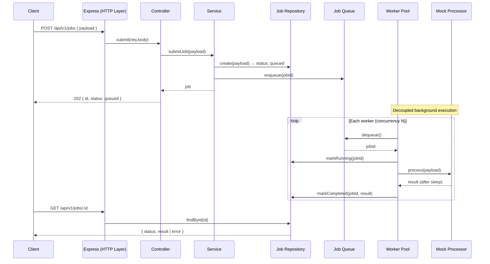

# REST API — Async Job Queue

A production-ready REST API built with **Node.js** and **TypeScript**. Clients submit jobs over HTTP; a background worker pool processes them asynchronously while a status endpoint tracks progress.

Designed for deployment to **GitHub** (with CI) and **DigitalOcean App Platform**.

## Features

- **Job submission** — `POST /api/v1/jobs` accepts a payload and returns a job ID immediately (`202 Accepted`)
- **Background worker pool** — configurable concurrency; mock processor simulates work with `sleep`
- **Status API** — `GET /api/v1/jobs/:id` returns `queued`, `running`, `completed`, or `failed` plus result/error
- **Health check** — `GET /health` for load balancers and App Platform probes
- **Concurrency control** — mutex-protected job state and queue operations
- **CI/CD** — GitHub Actions runs typecheck, lint, tests, and build on every push/PR

## Architecture

### Flow diagram



### Layer responsibilities

| Layer | Responsibility |
|-------|----------------|
| `routes/` | HTTP routing and request validation |
| `controllers/` | Request/response mapping |
| `services/` | Business logic (submit, lookup) |
| `repositories/` | Job persistence with mutex-protected updates |
| `queue/` | Async FIFO job queue with mutex-protected enqueue/dequeue |
| `workers/` | Worker pool and job processor |
| `concurrency/` | `AsyncMutex` for safe shared-state access |

### Concurrency control

HTTP handlers and background workers share the same in-memory job store and queue. Both can access state concurrently, so critical sections are serialized with an `AsyncMutex`:

- **Repository** — all reads and state transitions (`create`, `findById`, `markRunning`, `markCompleted`, `markFailed`) run inside `runExclusive()` blocks, preventing lost updates or invalid transitions when a worker updates status while a client polls `GET /jobs/:id`.
- **Queue** — `enqueue` and `dequeue` are mutex-protected so job IDs are handed to exactly one worker.
- **Status guards** — transitions enforce a strict lifecycle (`queued` → `running` → `completed`/`failed`); concurrent `markRunning` calls on the same job only succeed once.

## API

### Submit a job

```http
POST /api/v1/jobs
Content-Type: application/json

{
  "sleepMs": 2000,
  "data": { "task": "process-report" }
}
```

**Response `202 Accepted`**

```json
{
  "data": {
    "id": "550e8400-e29b-41d4-a716-446655440000",
    "status": "queued"
  }
}
```

| Field | Type | Description |
|-------|------|-------------|
| `sleepMs` | number (optional) | Simulated work duration in ms (default: `1000`) |
| `shouldFail` | boolean (optional) | Force failure for testing |
| `data` | object (optional) | Arbitrary payload echoed in the result |

### Get job status

```http
GET /api/v1/jobs/:id
```

**Response `200 OK`**

```json
{
  "data": {
    "id": "550e8400-e29b-41d4-a716-446655440000",
    "status": "completed",
    "payload": { "sleepMs": 2000, "data": { "task": "process-report" } },
    "result": {
      "processedAt": "2026-06-15T12:00:02.000Z",
      "sleepMs": 2000,
      "message": "Job completed successfully",
      "input": { "sleepMs": 2000, "data": { "task": "process-report" } }
    },
    "error": null,
    "createdAt": "2026-06-15T12:00:00.000Z",
    "updatedAt": "2026-06-15T12:00:02.000Z",
    "startedAt": "2026-06-15T12:00:00.100Z",
    "completedAt": "2026-06-15T12:00:02.000Z"
  }
}
```

### Health check

```http
GET /health
```

## Setup

**Requirements:** Node.js 20+

```bash
git clone <your-repo-url>
cd rest-api
npm install
```

## Execution

### Development

```bash
npm run dev
```

Server runs at `http://localhost:8080` with hot reload.

### Production

```bash
npm run build
npm start
```

### Example workflow

```bash
# Submit a job
curl -X POST http://localhost:8080/api/v1/jobs \
  -H "Content-Type: application/json" \
  -d '{"sleepMs": 2000, "data": {"task": "demo"}}'

# Poll for status (replace JOB_ID)
curl http://localhost:8080/api/v1/jobs/JOB_ID
```

## Scripts

| Command | Description |
|---------|-------------|
| `npm run dev` | Start dev server with hot reload |
| `npm run build` | Compile TypeScript to `dist/` |
| `npm start` | Run production build |
| `npm test` | Run all tests (unit + integration) |
| `npm run test:unit` | Run worker/repository unit tests |
| `npm run test:integration` | Run HTTP API integration tests |
| `npm run lint` | Lint source and tests |
| `npm run typecheck` | Type-check without emitting |

## Testing

Tests are split by scope:

| Suite | Location | Covers |
|-------|----------|--------|
| Unit | `tests/unit/` | Worker pool lifecycle, processor mock logic, repository concurrency |
| Integration | `tests/integration/` | Full HTTP request/response flow via supertest |

```bash
npm test                 # all tests
npm run test:unit        # unit only
npm run test:integration # integration only
```

## CI/CD

GitHub Actions (`.github/workflows/ci.yml`) runs on every push and pull request to `main`:

1. `npm ci`
2. `npm run typecheck`
3. `npm run lint`
4. `npm test`
5. `npm run build`

## Environment variables

| Variable | Default | Description |
|----------|---------|-------------|
| `PORT` | `8080` | HTTP listen port (DigitalOcean sets this automatically) |
| `NODE_ENV` | `development` | Runtime environment |
| `API_PREFIX` | `/api/v1` | API route prefix |
| `WORKER_CONCURRENCY` | `2` | Number of concurrent background workers |
| `WORKER_POLL_INTERVAL_MS` | `250` | Queue poll interval when idle |
| `DEFAULT_JOB_SLEEP_MS` | `1000` | Default simulated work duration |

## Deploy to DigitalOcean App Platform

1. Push this repository to GitHub.
2. In the [DigitalOcean control panel](https://cloud.digitalocean.com/apps), create a new **App** and connect your GitHub repo.
3. App Platform detects Node.js from `package.json`. Build and run commands:
   - **Build command:** `npm run build`
   - **Run command:** `npm start`
4. Set the HTTP port to **8080** (or rely on the `PORT` env var App Platform injects).
5. Configure the health check path to `/health`.

Alternatively, use the included spec file after updating the repo name:

```bash
# Edit .do/app.yaml — replace YOUR_GITHUB_USERNAME/YOUR_REPO_NAME
doctl apps create --spec .do/app.yaml
```

## Known limitations

| Limitation | Detail |
|------------|--------|
| **In-memory storage** | Jobs are lost on process restart; no persistence layer |
| **Single-instance only** | Queue and job store are in-process; horizontal scaling would require Redis/PostgreSQL and an external queue |
| **Polling required** | Clients must poll `GET /jobs/:id`; no webhooks or SSE |
| **No authentication** | All endpoints are public |
| **No rate limiting** | Unlimited job submission |
| **Mock processor** | Work is simulated via `sleep`; replace `MockJobProcessor` for real workloads |
| **Best-effort shutdown** | In-flight jobs may be interrupted on deploy/restart |

## License

MIT
